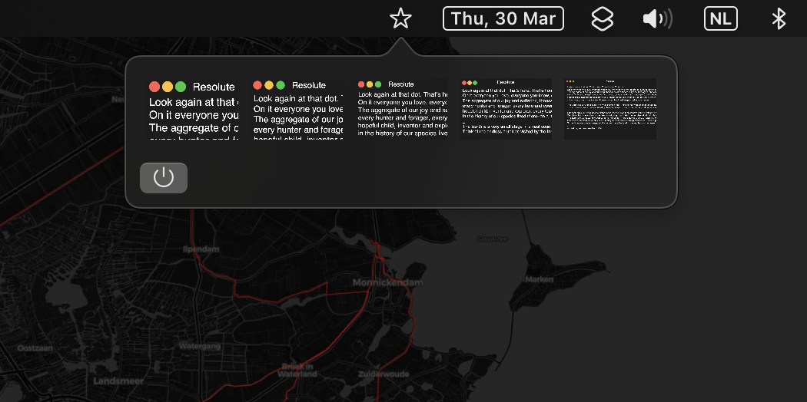

# Resolute

Resolute is a macOS menu bar utility that allows users to easily switch between different available display modes. Built with SwiftUI, this utility provides a simple and convenient way to manage your screen resolution directly from the menu bar.



## Features

- Displays available display modes for your main screen
- Allows switching between different display modes with a single click
- Icons for each display mode for better visualization
- Menu bar integration for quick access
- Automatically adapts to available display modes when connecting or disconnecting external monitors

## Prerequisites

- macOS 10.15 Catalina or later
- Xcode 12 or later

## Installation

1. Clone this repository:
```
git clone https://github.com/your_username/resolute-ui.git
```


2. Open the `resolute-ui.xcodeproj` file with Xcode.

3. Change the development team and bundle identifier if needed.

4. Build and run the application or archive the project to create a distributable app.

## Usage

Once the app is running, you'll find a new icon in your macOS menu bar. Click the icon to open the Resolute-UI popover. You'll see a list of available display modes for your main screen. Click on an icon to switch to that display mode. The popover will close, and the new display mode will be applied.

## Contributing

Pull requests and suggestions are welcome. If you want to contribute, please feel free to submit a pull request, or open an issue to discuss your ideas.

## License

This project is licensed under the MIT License - see the [LICENSE](LICENSE) file for details.

